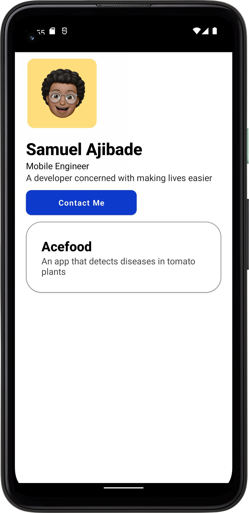

Business Card
=================

A Portfolio app illustrating Android development practices with Jetpack Compose

Build Info
=================

The Minimum SDK Version for the project 22 and the Compile SDK Version is 32

Introduction
=================

Business Card is an android application that showcases part of my portfolio i developed it with Jetpack Compose as that is the direction android development is going in and i am constantly trying to learn more about Jetpack Compose and Kotlin and working towards improving my skills in this area.

Getting Started
---------------
This project uses the Gradle build system. To build this project, use the `gradlew build` command or use "Import Project" in Android Studio.

Libraries Used
---------------
* Android KTX
* Jetpack Compose
* Compose Material

Screenshots
---------------

License
---------------

MIT License

Copyright (c) 2022 Samuel Ajibade

Permission is hereby granted, free of charge, to any person obtaining a copy
of this software and associated documentation files (the "Software"), to deal
in the Software without restriction, including without limitation the rights
to use, copy, modify, merge, publish, distribute, sublicense, and/or sell
copies of the Software, and to permit persons to whom the Software is
furnished to do so, subject to the following conditions:

The above copyright notice and this permission notice shall be included in all
copies or substantial portions of the Software.

THE SOFTWARE IS PROVIDED "AS IS", WITHOUT WARRANTY OF ANY KIND, EXPRESS OR
IMPLIED, INCLUDING BUT NOT LIMITED TO THE WARRANTIES OF MERCHANTABILITY,
FITNESS FOR A PARTICULAR PURPOSE AND NONINFRINGEMENT. IN NO EVENT SHALL THE
AUTHORS OR COPYRIGHT HOLDERS BE LIABLE FOR ANY CLAIM, DAMAGES OR OTHER
LIABILITY, WHETHER IN AN ACTION OF CONTRACT, TORT OR OTHERWISE, ARISING FROM,
OUT OF OR IN CONNECTION WITH THE SOFTWARE OR THE USE OR OTHER DEALINGS IN THE
SOFTWARE.

